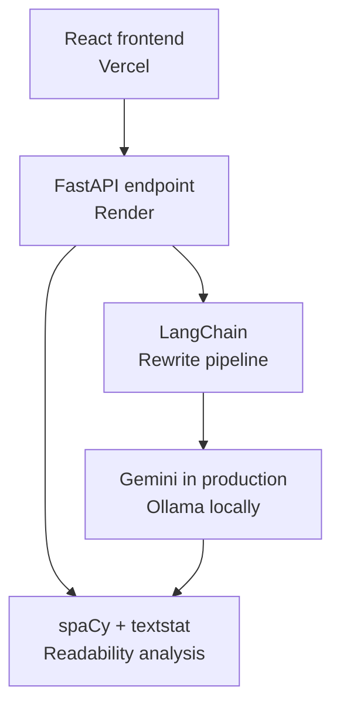
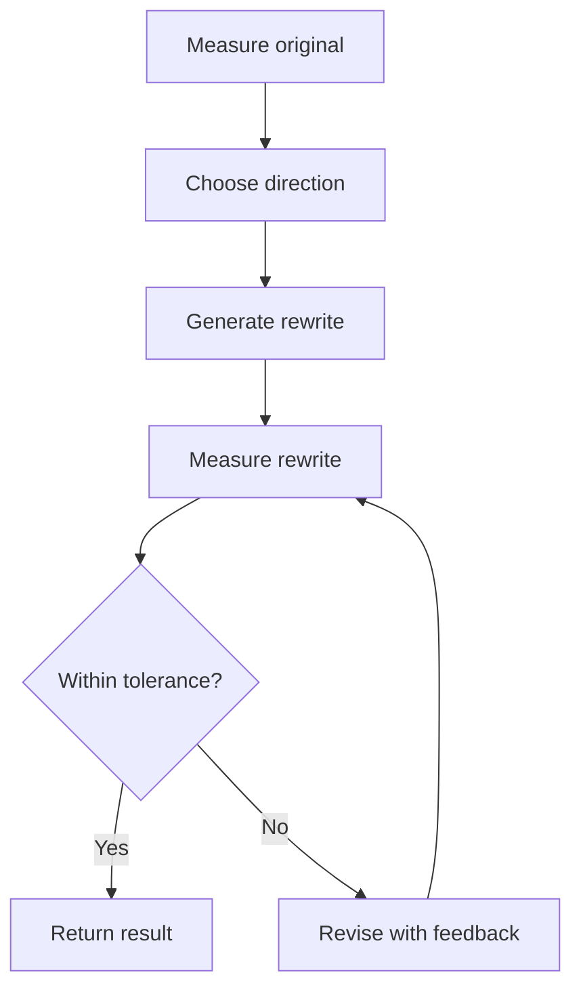

# Readability Lab

ReadabilityLab adjusts writing to a target reading level while preserving its essential meaning. It can simplify complex passages for broader audiences or elevate simple prose for more advanced readers, then verifies the result using objective readability metrics.

[Live Demo](https://readability-lab.vercel.app/) · [API Documentation](https://readability-lab.onrender.com/docs)

## What it does

Users submit a passage and select a target grade level. ReadabilityLab then:

- Measures the original passage
- Determines whether to simplify or elevate it
- Rewrites it using a large language model
- Measures the rewritten passage
- Revises the result when it misses the target
- Returns the best attempt after at most three iterations

The interface displays the original and rewritten metrics together so users can see how the text changed.

## Architecture



### Technology stack

**Frontend**

- React
- Vite
- JavaScript
- Vercel

**Backend**

- Python
- FastAPI
- Pydantic
- Uvicorn
- Render

**Language processing**

- LangChain for model orchestration
- Gemini for deployed text generation
- Ollama for local development
- textstat for Flesch–Kincaid grade level and syllable counts
- spaCy for sentence segmentation and dependency-tree analysis

## Verify-and-revise loop

ReadabilityLab does not assume that the model’s first response matches the requested level. Instead, it measures and verifies each rewrite.



The process works as follows:

1. The backend calculates the original Flesch–Kincaid grade level.

2. It compares that score with the requested target.

3. If the original is too complex, the model receives simplification instructions.

4. If the original is too simple, the model receives elevation instructions.

5. The backend measures the resulting rewrite.

6. If the score is outside the accepted tolerance, the model receives concrete feedback such as:

   > The current rewrite is grade 12, but the target is grade 8. Shorten sentences and simplify vocabulary further.

7. The direction is recalculated after each attempt in case the model overshoots the target.

8. The loop stops when the result reaches the target range or after three attempts.

9. If no attempt reaches the range, the backend returns the attempt closest to the target.

Limiting the loop prevents unbounded model calls while still improving reliability over a one-shot prompt.

## Example: simplifying scientific text

**Target: Grade 5**

### Before

> Photosynthesis is the biochemical process through which plants, algae, and certain bacteria convert light energy into chemical energy. During this process, organisms use sunlight, water, and carbon dioxide to produce glucose and release oxygen.

### After

> Some living things make food from light. This is called photosynthesis. Plants, algae, and some bacteria do this. They use sunlight and water. They also use carbon dioxide. They make a sugar called glucose. They also make oxygen.

### Metric comparison

| Metric                  |   Original | Rewritten | Change |
| ----------------------- | ---------: | --------: | -----: |
| Flesch–Kincaid grade    |       15.7 |       4.5 |  -11.1 |
| Average sentence length | 17.0 words | 5.4 words |  -11.6 |
| Average syntax depth    |        6.0 |       3.1 |   -2.9 |
| Maximum syntax depth    |          7 |         5 |     -2 |
| Syllables               |         71 |        58 |    -13 |

The verify-and-revise loop reached the target range in two attempts.

## Example: elevating simple prose

**Target: Grade 10**

### Before

> The storm came at night. The wind was strong. Trees fell down. People stayed inside until morning.

### After

> The powerful storm arrived at night, bringing winds strong enough to topple trees. Consequently, residents remained sheltered indoors until morning.

### Metric comparison

| Metric                  |  Original |  Rewritten | Change |
| ----------------------- | --------: | ---------: | -----: |
| Flesch–Kincaid grade    |       0.6 |        9.6 |   +8.9 |
| Average sentence length | 4.3 words | 10.0 words |   +5.8 |
| Average syntax depth    |       2.8 |        4.0 |   +1.3 |
| Maximum syntax depth    |         3 |          5 |     +2 |
| Syllables               |        21 |         36 |    +15 |

Elevation is intentionally constrained to the ideas already present in the source. The model may use more precise vocabulary and richer sentence structure, but it should not invent events, evidence, or unsupported nuance.

## API

### `POST /api/adjust`

Adjusts a passage to a requested reading level.

#### Request

```json
{
  "text": "The passage to adjust.",
  "target_level": 8
}
```

#### Response

```json
{
  "original_metrics": {
    "flesch_kincaid_grade": 12.4,
    "syllable_count": 42,
    "average_sentence_length": 18.0,
    "average_dependency_depth": 5.5,
    "maximum_dependency_depth": 7
  },
  "rewritten_text": "The adjusted passage.",
  "rewritten_metrics": {
    "flesch_kincaid_grade": 8.2,
    "syllable_count": 35,
    "average_sentence_length": 12.0,
    "average_dependency_depth": 4.3,
    "maximum_dependency_depth": 5
  },
  "iterations": 2,
  "direction": "simplify"
}
```

## Running locally

### Backend

Create and activate a Python virtual environment:

```bash
python3 -m venv backend/.venv
source backend/.venv/bin/activate
```

Install the dependencies and language models:

```bash
python -m pip install -r backend/requirements.txt
python -m spacy download en_core_web_sm
python -m nltk.downloader cmudict
```

Create `backend/.env`:

```env
LLM_PROVIDER=ollama
```

Start Ollama:

```bash
ollama serve
```

Start FastAPI from the backend directory:

```bash
cd backend
python -m uvicorn main:app --reload
```

The API is available at `http://127.0.0.1:8000`, with interactive documentation at `http://127.0.0.1:8000/docs`.

### Frontend

In another terminal:

```bash
cd frontend
npm install
npm run dev
```

The frontend is available at `http://localhost:5173`.

## Environment variables

| Variable         | Environment | Purpose                                      |
| ---------------- | ----------- | -------------------------------------------- |
| `LLM_PROVIDER`   | Backend     | Selects `ollama` or `gemini`                 |
| `GOOGLE_API_KEY` | Render      | Authenticates deployed Gemini requests       |
| `NLTK_DATA`      | Render      | Identifies the deployed NLTK data directory  |
| `FRONTEND_URL`   | Render      | Permits the Vercel origin through CORS       |
| `VITE_API_URL`   | Vercel      | Points React to the deployed FastAPI service |

API keys remain exclusively on the backend and are never exposed to the browser.

## Current limitations

- Reading grade formulas are estimates, not guarantees of comprehension.
- A lower or higher score does not automatically mean that a rewrite is better.
- Technical vocabulary can make an accurate passage score above its requested level.
- Elevating text is harder than simplifying it without introducing filler or unsupported detail.
- Model output should still be reviewed when factual precision is important.

## Future improvements

- Targeted linguistic revisions: Use spaCy to identify specific sources of difficulty—such as long sentences, rare words, and deeply nested clauses. Ask the language model to revise only those spans.
- Explainable complexity analysis: Show why a passage is difficult instead of reporting only numeric scores. For example, identify sentences with embedded clauses, unusually complex syntax, or high lexical difficulty.
- Rule-based NLP baseline: Build a lightweight simplification method using sentence splitting and synonym substitution, then compare its accuracy and meaning preservation with the LLM-based pipeline.
- Stronger evaluation: Test the system across more genres and grade levels, measuring target accuracy, semantic preservation, and the number of revision attempts required.
- Adjustment history: Allow users to save and compare previous rewrites and their metrics.

These improvements would shift more responsibility from the language model to an interpretable NLP pipeline, making the system easier to evaluate and its revisions easier to explain.
